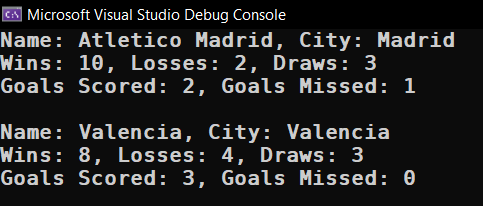
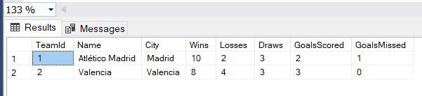

# Module 6.1

<h2>Football League</h2>

* [Program.cs](FootballLeague/Program.cs)
* [Entities/](FootballLeague/Entities/)
  - [Team.cs](FootballLeague/Entities/Team.cs)
* [FootballLeagueContext.cs](FootballLeague/FootballLeagueContext.cs)
* [Migrations/](FootballLeague/Migrations)
  - [InitialCreate.cs](FootballLeague/Migrations/20240313081955_InitialCreate.cs)
  - [AddGoalsFields.cs](FootballLeague/Migrations/20240313082558_AddGoalsFields.cs)
  - [AddAnnotations.cs](FootballLeague/Migrations/20240313141912_AddAnnotations.cs)

